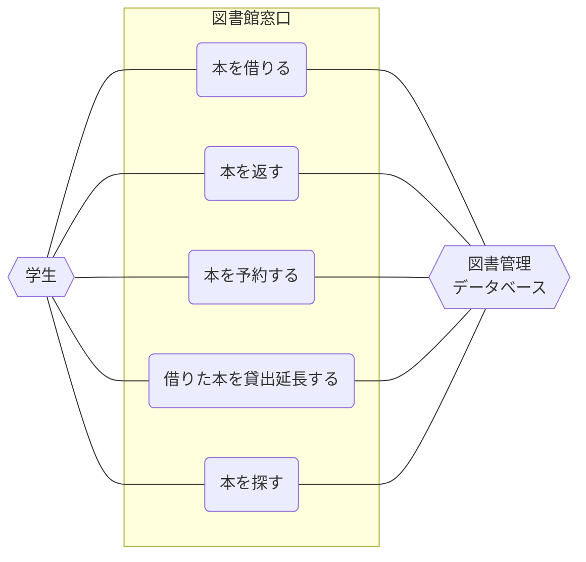

```mermaid

flowchart LR
a{{学生}}
b(本を借りる)
c(本を返す)
d(本を予約する)
e(借りた本を貸出延長する)
f(本を探す)
a --- b
a --- c
a --- d
a --- e
a --- f
m{{図書管理\nデータベース}}
b --- m
c --- m
d --- m
e --- m
f --- m

subgraph 図書館窓口

b
c
d
e
f
end
```
